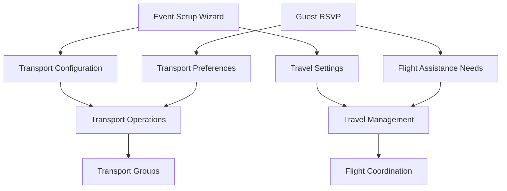

# Comprehensive Travel & Transport Module Architecture Audit
*July 15, 2025*

## Executive Summary

This comprehensive audit examines the complete Travel and Transport module architecture within the Indian Wedding RSVP Platform, analyzing implementation status, data flow, integration points, and identifying critical gaps for production readiness.

## Architecture Overview

### Module Separation and Responsibilities

**Transport Module** (`/transport`)
- **Purpose**: Group vehicle management and coordination
- **Scope**: Bus/car transport groups, vendor management, passenger allocation
- **Target Users**: Wedding planners, transport coordinators
- **Implementation Status**: 70% complete

**Travel Module** (`/travel-management`)  
- **Purpose**: Individual flight coordination and airport assistance
- **Scope**: Flight tracking, airport representatives, guest travel details
- **Target Users**: Travel coordinators, airport representatives
- **Implementation Status**: 40% complete

## Implementation Status Analysis

### Transport Module Assessment

#### ✅ Completed Components
1. **Backend Infrastructure** (100%)
   - Database schema: `transport_vendors`, `event_vehicles`, `transport_groups`
   - API routes: Vendor CRUD, vehicle management, group operations
   - Data models: Vendor profiles, vehicle specifications, passenger allocation

2. **Event Setup Wizard Integration** (100%)
   - Transport configuration step in wizard
   - Transport mode selection (none/selected/full)
   - Provider setup and guest instructions
   - Database persistence with proper type conversion

3. **Basic Transport Page** (60%)
   - Statistics dashboard with transport metrics
   - Navigation integration in sidebar
   - DashboardLayout with glassmorphism design

#### ⚠️ Missing Components
1. **Operational Transport UI** (0%)
   - Transport group creation interface
   - Passenger assignment workflows
   - Real-time vehicle capacity tracking
   - Driver communication system

2. **Vendor Management Interface** (30%)
   - Vendor onboarding forms
   - Service agreement tracking
   - Performance monitoring dashboard

3. **Guest Integration** (20%)
   - Transport preference collection in RSVP
   - Automatic group assignment algorithms
   - Guest transport status tracking

### Travel Module Assessment

#### ✅ Completed Components
1. **Database Architecture** (80%)
   - Schema: `guest_travel_info`, `location_representatives`
   - Flight coordination data structure
   - Airport representative management

2. **Basic Travel Management Page** (50%)
   - Flight coordination dashboard layout
   - Guest travel information display
   - Airport representative cards

#### ⚠️ Missing Components
1. **Flight Coordination Workflow** (10%)
   - Flight list collection interface
   - Travel agent export functionality
   - Flight detail import system
   - Guest communication automation

2. **Airport Representative System** (20%)
   - Representative onboarding
   - Guest assignment workflows
   - Real-time coordination tools

3. **RSVP Integration** (40%)
   - Stage 2 flight assistance requests
   - Travel preference collection
   - Automatic coordination triggering

## Data Flow Architecture

### Event Setup Wizard → Operations Flow

#### Current Integration Status
- **Wizard → Transport**: ✅ Complete (transport mode, providers)
- **Wizard → Travel**: ✅ Complete (flight assistance mode, representatives)
- **RSVP → Transport**: ⚠️ Partial (basic preferences only)
- **RSVP → Travel**: ⚠️ Partial (flight needs indication)

## Critical Missing Features

### 1. Master Guest View Integration
**Status**: Missing
**Impact**: High
**Description**: No single interface showing complete guest information including transport assignments and flight coordination status.

**Required Implementation**:
- Enhanced Guest List with transport/travel columns
- Combined view of accommodation, transport, and flight details
- Status tracking across all modules

### 2. Operational Workflow Interfaces
**Status**: Missing
**Impact**: Critical
**Description**: Event setup wizard captures configuration but lacks operational management interfaces.

**Transport Workflows Needed**:
- Transport group creation with capacity management
- Passenger assignment with family grouping logic
- Driver coordination and communication
- Real-time vehicle tracking integration

**Travel Workflows Needed**:
- Flight list collection and export for travel agents
- Flight detail import and guest matching
- Airport representative assignment and coordination
- Guest flight confirmation and updates

### 3. Communication Integration
**Status**: Partial
**Impact**: Medium
**Description**: Communication templates exist but lack integration with transport/travel operations.

**Missing Integrations**:
- Automated transport confirmation emails
- Flight coordination updates via WhatsApp
- Airport pickup notifications
- Transport group formation announcements

## Database Schema Analysis

### Transport Tables Status
- ✅ `transport_vendors`: Complete with contact and service details
- ✅ `event_vehicles`: Complete with capacity and specifications  
- ✅ `transport_groups`: Complete with passenger allocation
- ⚠️ `guest_transport_preferences`: Partial implementation in guest_travel_info

### Travel Tables Status
- ✅ `guest_travel_info`: Complete with flight and accommodation details
- ✅ `location_representatives`: Complete with airport representative data
- ❌ `flight_coordination_requests`: Missing dedicated flight tracking
- ❌ `airport_assistance_assignments`: Missing representative assignments

## Integration Points Analysis

### 1. RSVP Module Integration
**Current Status**: Basic structure exists
**Missing Elements**:
- Transport preference UI in Stage 2 RSVP form
- Flight assistance request workflow
- Automatic data population to transport/travel modules

### 2. Communication Module Integration
**Current Status**: Template framework exists
**Missing Elements**:
- Transport-specific template variables
- Flight coordination email automation
- WhatsApp integration for real-time updates

### 3. Accommodation Module Integration
**Current Status**: Separate systems
**Missing Elements**:
- Hotel shuttle coordination
- Airport transfer integration with accommodation
- Combined booking confirmations

## Performance and Scalability Considerations

### Current Architecture Strengths
- Multi-tenant design with proper event isolation
- Scalable database schema with indexed relationships
- Modular API structure for independent scaling

### Potential Bottlenecks
- Real-time coordination may require WebSocket implementation
- Large guest lists need optimized group assignment algorithms
- File import/export processes need async handling

## Security and Privacy Assessment

### Data Protection
- ✅ Event-level data isolation implemented
- ✅ Role-based access control in place
- ⚠️ Flight information requires enhanced encryption
- ⚠️ Representative contact details need access auditing

### API Security
- ✅ Authentication middleware implemented
- ✅ Input validation with Zod schemas
- ⚠️ Rate limiting needed for import/export operations
- ⚠️ File upload security for flight data imports

## Implementation Roadmap

### Phase 1: Core Operational Interfaces (Priority: Critical)
**Timeline**: 2-3 weeks
1. Transport group creation and management interface
2. Flight coordination workflow implementation
3. Master guest view with transport/travel integration
4. Enhanced RSVP Stage 2 with transport/travel preferences

### Phase 2: Advanced Features (Priority: High)
**Timeline**: 2-3 weeks
1. Automated group assignment algorithms
2. Communication template integration
3. Real-time coordination dashboards
4. Airport representative management system

### Phase 3: Enhanced Integration (Priority: Medium)
**Timeline**: 1-2 weeks
1. Accommodation module integration
2. Advanced reporting and analytics
3. Mobile optimization for coordinators
4. Third-party service integrations

## Testing Strategy

### Unit Testing Requirements
- Transport group assignment logic
- Flight coordination workflows
- Data import/export functions
- Communication trigger systems

### Integration Testing Focus
- RSVP to transport/travel data flow
- Wizard configuration to operational systems
- Cross-module data consistency
- Communication template rendering

### User Acceptance Testing
- Wedding planner workflows
- Guest experience from RSVP to coordination
- Airport representative interfaces
- Vendor and driver coordination tools

## Conclusion

The Travel and Transport module architecture demonstrates solid foundational work with comprehensive database design and proper system separation. However, critical operational interfaces and workflow implementations are missing for production readiness.

**Immediate Actions Required**:
1. Implement core operational interfaces for transport group and flight coordination management
2. Create master guest view integrating all module data
3. Complete RSVP integration for transport and travel preferences
4. Establish communication automation between modules

**Success Metrics**:
- 100% workflow completion from guest RSVP to transport/travel coordination
- Single-click group assignment for 200+ guest events
- Real-time coordination capabilities for airport representatives
- Automated communication triggers reducing manual coordination by 80%

The architecture is well-positioned for scaling to handle large Indian wedding events with proper implementation of these missing operational components.