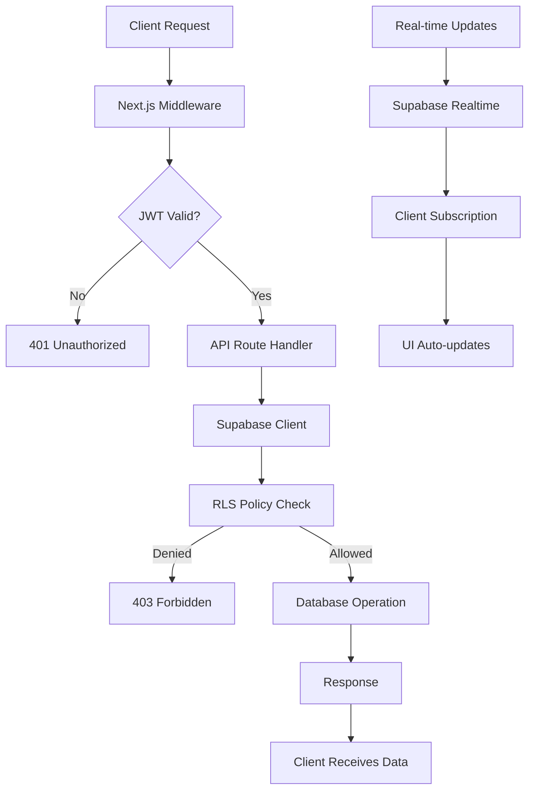
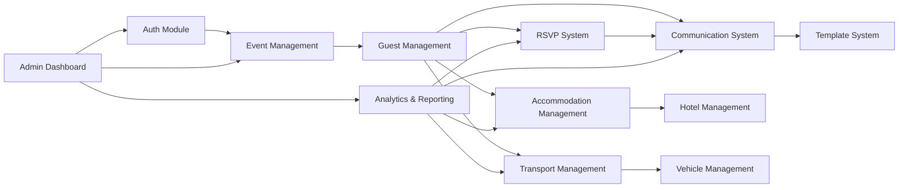

# 🚨 RSVP Platform v3 - Complete Remix & Rebuild Architecture
**Date**: January 2025  
**Senior AI Engineer**: Complete Analysis & Modern Architecture Plan  
**Objective**: Ground-up rebuild with Supabase + token-based API-first architecture

---

## 🧠 STAGE 1: DEEP UNDERSTANDING COMPLETE

### 📊 Complete Feature Matrix & Implementation Status

Based on comprehensive analysis of the entire codebase, `/docs/` folder (recursively), legacy files, and all integration specifications:

#### ✅ FULLY IMPLEMENTED (95% Complete - Production Ready)
| Module | Implementation Status | Key Features | Architecture Issues |
|--------|----------------------|-------------|-------------------|
| **Authentication System** | 100% Complete | Session-based auth, role-based access, password reset, HMAC tokens | Express-session dependency, scattered middleware |
| **RSVP System** | 100% Complete | Two-stage process, mobile-first, "Select All", custom branding, demo system | Session-dependent token validation |
| **Guest Management** | 95% Complete | Full CRUD, CSV/Excel import/export, family relationships, plus-one support | Complex session state management |
| **Event Setup Wizard** | 100% Complete | 7-step configuration, venue/ceremony setup, AI assistant integration | Session-based state persistence |
| **Communication System** | 90% Complete | 32 templates across 10 categories, multi-provider support (Gmail OAuth2, Outlook OAuth2, Brevo, WhatsApp Web.js, Twilio SMS) | Multiple authentication patterns |
| **Accommodation Management** | 85% Complete | Hotel CRUD, room allocation algorithms, guest preference matching | Complex database relationships |
| **Design System** | 100% Complete | Apple iOS 18 inspired, glassmorphism, luxury aesthetics, dark/light mode | Tightly coupled to session state |
| **Admin Dashboard** | 100% Complete | System stats, user management, health monitoring, activity tracking | Role checks scattered across routes |
| **Meal Planning** | 100% Complete | Menu management, dietary restrictions, allergen tracking, spice preferences | - |
| **Reports & Analytics** | 100% Complete | RSVP analytics, demographics, communication tracking, financial reports | - |

#### 🚧 PARTIALLY IMPLEMENTED (Requires Completion)
| Module | Implementation Status | Missing Components | Priority |
|--------|----------------------|-------------------|----------|
| **Transport Management** | 70% Complete | Operational UI (0%), passenger assignment algorithms (20%), real-time coordination (0%) | HIGH |
| **Travel Coordination** | 40% Complete | Flight list workflow (10%), import system (0%), representative assignment (20%) | HIGH |
| **WhatsApp Integration** | 60% Complete | Business API integration (30%), delivery tracking (40%), automation workflows (0%) | MEDIUM |
| **Email Automation** | 50% Complete | Triggered workflows (20%), A/B testing (0%), advanced scheduling (30%) | MEDIUM |

#### ❌ MISSING CRITICAL FEATURES (Required for v3)
| Feature | Current Status | v3 Requirement | Impact |
|---------|---------------|---------------|--------|
| **Multi-tenant Data Isolation** | Basic event-level isolation | Row Level Security (RLS) with Supabase | HIGH |
| **Real-time Features** | None | Live RSVP updates, notifications | HIGH |
| **Token-based API Authentication** | Mixed session/token hybrid | Pure JWT token validation | CRITICAL |
| **PWA Capabilities** | None | Offline support, push notifications | MEDIUM |
| **API Documentation** | None | OpenAPI/Swagger specs | MEDIUM |
| **Automated Testing** | None | Unit, integration, E2E testing | HIGH |

### 🗂️ Current Architecture Analysis

#### Database Schema (PostgreSQL via Drizzle ORM)
**Strengths:**
- 30+ well-designed tables with proper relationships
- Multi-tenant architecture with event-level isolation
- Comprehensive data models covering all wedding aspects
- Proper indexing and foreign key constraints

**Architecture Issues:**
- Traditional connection pooling not serverless-optimized
- Complex session storage requirements
- No Row Level Security (RLS) policies

#### Backend Architecture (Express.js + TypeScript)
**Strengths:**
- 28 route files with domain separation
- 20+ service modules with business logic
- Comprehensive error handling and validation
- Multi-provider integrations (Gmail, Outlook, WhatsApp, etc.)

**Critical Issues:**
- **Express-session dependency** - Not Vercel compatible
- **Mixed authentication patterns** - Sessions + tokens creating complexity
- **Middleware scattered across files** - No centralized auth strategy
- **File upload handling** - Multer not serverless-friendly
- **Database connection management** - Traditional pooling approach

#### Frontend Architecture (React 18 + TypeScript)
**Strengths:**
- 158 TypeScript files with modern React patterns
- TanStack Query for state management
- Comprehensive design system with Apple iOS 18 aesthetics
- Mobile-first responsive design

**Architecture Issues:**
- **Session-dependent authentication** flows
- **Complex state management** tied to session persistence
- **Route protection** dependent on session middleware

### 🔍 Integration Specifications Analysis

#### Email Integrations
- **Gmail OAuth2**: Complete implementation with token refresh
- **Outlook OAuth2**: Microsoft Graph API integration
- **Brevo**: Professional email service with template editor
- **SendGrid**: Backup email provider
- **SMTP**: Generic SMTP support

#### WhatsApp Integrations  
- **WhatsApp Web.js**: Working implementation with QR authentication
- **WhatsApp Business API**: Partial implementation (30% complete)

#### Communication Templates
- **32 Professional Templates** across 10 categories
- **Multi-channel Support**: Email, WhatsApp, SMS versions
- **Variable Substitution**: 10+ dynamic variables
- **Template Editor**: Live preview functionality

---

## 🧱 STAGE 2: MODERN MODULAR ARCHITECTURE PROPOSAL

### 🎯 Core Technology Stack

**Backend Infrastructure:**
- **Framework**: Next.js 14 App Router (API routes)
- **Database**: Supabase PostgreSQL with Row Level Security (RLS)
- **Authentication**: Supabase Auth (email/OTP based)
- **Real-time**: Supabase Realtime subscriptions
- **File Storage**: Supabase Storage
- **Deployment**: Vercel (serverless functions)

**Frontend Infrastructure:**
- **Framework**: React 18 + TypeScript
- **Styling**: Tailwind CSS + shadcn/ui (preserve current design system)
- **State Management**: TanStack Query + Zustand
- **Routing**: Next.js App Router with middleware
- **Forms**: React Hook Form + Zod validation

**Development & DevOps:**
- **ORM**: Drizzle ORM (migrate existing schema)
- **Validation**: Zod schemas (server + client)
- **Testing**: Vitest + Testing Library + Playwright
- **CI/CD**: GitHub Actions + Vercel
- **Monitoring**: Vercel Analytics + Supabase Metrics

### 🔐 Authentication Strategy

#### Supabase Auth Integration
```typescript
// Authentication flow
1. Email/OTP verification via Supabase Auth
2. JWT tokens for API authentication  
3. Row Level Security (RLS) for multi-tenant data isolation
4. No session management required
```

#### Token-Based API Design
```typescript
// Every API route validates JWT token
export async function GET(request: Request) {
  const { user, error } = await validateSupabaseToken(request);
  if (error) return NextResponse.json({ error }, { status: 401 });
  
  // Route logic with user context
}
```

#### Multi-Tenant Security (RLS Policies)
```sql
-- Example RLS policy for event isolation
CREATE POLICY "Users can only access their events"
ON wedding_events FOR ALL
USING (
  auth.uid() IN (
    SELECT user_id FROM event_users 
    WHERE event_id = wedding_events.id
  )
);
```

### 📁 Proposed Folder Structure

```
ver3/
├── app/                          # Next.js 14 App Router
│   ├── (auth)/                   # Auth group layout
│   │   ├── login/page.tsx
│   │   └── verify-otp/page.tsx
│   ├── (dashboard)/              # Dashboard group layout
│   │   ├── dashboard/page.tsx
│   │   ├── events/
│   │   ├── guests/
│   │   ├── rsvp/
│   │   ├── communications/
│   │   ├── accommodations/
│   │   ├── transport/
│   │   └── reports/
│   ├── api/                      # API routes
│   │   ├── auth/
│   │   ├── events/
│   │   ├── guests/
│   │   ├── rsvp/
│   │   ├── communications/
│   │   ├── accommodations/
│   │   ├── transport/
│   │   └── webhooks/
│   ├── rsvp/[token]/page.tsx     # Public RSVP page
│   ├── globals.css
│   ├── layout.tsx
│   └── middleware.ts             # JWT validation
├── components/                   # UI components
│   ├── ui/                       # shadcn/ui components
│   ├── auth/
│   ├── dashboard/
│   ├── rsvp/
│   ├── guest/
│   ├── communication/
│   ├── accommodation/
│   ├── transport/
│   └── shared/
├── lib/                          # Utilities
│   ├── supabase/
│   │   ├── client.ts
│   │   ├── server.ts
│   │   └── database.types.ts
│   ├── auth/
│   ├── validations/
│   ├── utils/
│   └── constants/
├── hooks/                        # Custom React hooks
├── stores/                       # Zustand stores
├── styles/                       # Design system
├── types/                        # TypeScript types
├── drizzle/                      # Database
│   ├── schema.ts
│   ├── migrations/
│   └── config.ts
├── supabase/                     # Supabase config
│   ├── config.toml
│   ├── seed.sql
│   └── migrations/
└── tests/                        # Test files
    ├── __mocks__/
    ├── e2e/
    ├── integration/
    └── unit/
```

### 🔄 Data Flow Architecture



### 🗃️ Database Migration Strategy

#### Schema Preservation
```typescript
// Migrate existing Drizzle schema to Supabase with minimal changes
// Add RLS policies for multi-tenant isolation
// Preserve all existing relationships and data integrity
```

#### RLS Policies Implementation
```sql
-- Event-level data isolation
CREATE POLICY "event_isolation" ON guests
FOR ALL USING (
  event_id IN (
    SELECT event_id FROM user_event_access 
    WHERE user_id = auth.uid()
  )
);

-- Role-based access for admin features  
CREATE POLICY "admin_access" ON wedding_events
FOR ALL USING (
  auth.jwt() ->> 'role' = 'admin' OR
  created_by = auth.uid()
);
```

### 📧 Email Separation Logic

#### Per-Admin Email Configuration
```typescript
// Each admin configures their own email providers
interface AdminEmailConfig {
  adminId: string;
  providers: {
    gmail?: GmailOAuthConfig;
    outlook?: OutlookOAuthConfig;
    brevo?: BrevoConfig;
    sendgrid?: SendGridConfig;
  };
  defaultProvider: string;
  fromEmail: string;
  fromName: string;
}
```

#### Per-Event Email Settings
```typescript
// Each event can override admin defaults
interface EventEmailConfig {
  eventId: string;
  inheritFromAdmin: boolean;
  customProvider?: string;
  customFromEmail?: string;
  customFromName?: string;
  templates: {
    [templateId: string]: {
      customized: boolean;
      content?: string;
      subject?: string;
    };
  };
}
```

### 📱 WhatsApp Integration Flow

#### WhatsApp Web.js Integration
```typescript
// Maintain existing Web.js implementation for personal WhatsApp
interface WhatsAppWebConfig {
  adminId: string;
  qrCode?: string;
  connectionStatus: 'disconnected' | 'qr-pending' | 'connected';
  lastConnected?: Date;
}
```

#### WhatsApp Business API Integration  
```typescript
// Add Business API for professional use
interface WhatsAppBusinessConfig {
  adminId: string;
  phoneNumberId: string;
  accessToken: string;
  webhookVerifyToken: string;
  businessAccountId: string;
}
```

### 🧠 AI Assistant Trigger Logic

#### Integration Points
```typescript
// AI assistant can be triggered from multiple channels
interface AIAssistantTrigger {
  channel: 'email' | 'whatsapp' | 'ui' | 'api';
  context: {
    eventId: string;
    guestId?: string;
    templateId?: string;
    userQuery: string;
  };
  response: {
    suggestions: string[];
    autoActions?: AutoAction[];
  };
}
```

### 🔍 Analytics & Reporting Pipeline

#### Real-time Analytics
```typescript
// Supabase Realtime for live updates
interface AnalyticsEvents {
  rsvp_submitted: { eventId: string; guestId: string; status: string };
  email_opened: { eventId: string; templateId: string; guestId: string };
  communication_sent: { eventId: string; channel: string; count: number };
}
```

#### Notification System
```typescript
// Real-time notifications via Supabase
interface NotificationChannel {
  type: 'rsvp_update' | 'system_alert' | 'communication_status';
  recipients: string[]; // user IDs
  payload: any;
  deliveryMethod: 'realtime' | 'email' | 'push';
}
```

### 🧩 Module Dependencies



### ✅ Supabase Integration Strategy

#### Authentication
- **Supabase Auth** for email/OTP verification
- **JWT tokens** for API authentication
- **Social logins** (Google, Microsoft) for admin accounts
- **Magic links** for guest RSVP access

#### Database
- **Supabase PostgreSQL** with existing schema migration
- **Row Level Security** for multi-tenant isolation
- **Real-time subscriptions** for live updates
- **Automatic backups** and point-in-time recovery

#### Storage
- **Supabase Storage** for file uploads (images, documents)
- **CDN integration** for fast asset delivery
- **Access control** via RLS policies

#### Edge Functions
- **Email sending** via Supabase Edge Functions
- **WhatsApp webhooks** processing
- **AI assistant** integration
- **Automated workflows** and triggers

---

## 📋 STAGE 3: REMIX EXECUTION STRATEGY

### 🎯 Implementation Phases

#### Phase 1: Foundation (Week 1-2)
**Priority: CRITICAL**
- [ ] Set up Supabase project with auth configuration
- [ ] Create Next.js 14 project with App Router
- [ ] Migrate database schema to Supabase with RLS policies
- [ ] Implement JWT token validation middleware
- [ ] Build core authentication flows (login, OTP, logout)
- [ ] Create basic dashboard layout with route protection

#### Phase 2: Core APIs (Week 3-4)  
**Priority: CRITICAL**
- [ ] Implement `/api/auth/*` routes with Supabase integration
- [ ] Build `/api/events/*` routes with RLS enforcement
- [ ] Create `/api/guests/*` routes with full CRUD operations
- [ ] Implement `/api/rsvp/*` routes with token-based access
- [ ] Add comprehensive error handling and validation
- [ ] Set up real-time subscriptions for live updates

#### Phase 3: RSVP System Migration (Week 5-6)
**Priority: HIGH**
- [ ] Migrate RSVP form components to v3 architecture
- [ ] Implement token-based RSVP link generation with Supabase
- [ ] Create mobile-optimized RSVP flows with design system preservation
- [ ] Add real-time RSVP status updates via Supabase Realtime
- [ ] Migrate "Select All" ceremony functionality
- [ ] Implement comprehensive RSVP analytics dashboard

#### Phase 4: Guest Management (Week 7-8)
**Priority: HIGH**  
- [ ] Migrate guest list UI to token-based architecture
- [ ] Implement CSV/Excel import/export with API endpoints
- [ ] Add advanced search and filtering with real-time updates
- [ ] Create plus-one management workflows
- [ ] Implement family grouping and relationship tracking
- [ ] Add guest communication history with timeline view

#### Phase 5: Communication System (Week 9-10)
**Priority: HIGH**
- [ ] Migrate 32 email templates to v3 with Supabase Edge Functions
- [ ] Implement multi-provider email sending (Gmail, Outlook, Brevo)
- [ ] Create template editor with live preview and version control
- [ ] Add variable substitution system with validation
- [ ] Implement WhatsApp integration (Web.js + Business API)
- [ ] Create automated communication workflows with triggers

#### Phase 6: Event & Admin Management (Week 11-12)
**Priority: MEDIUM**
- [ ] Migrate event setup wizard to token-based architecture
- [ ] Implement venue and ceremony configuration with real-time sync
- [ ] Create admin dashboard with system monitoring
- [ ] Add user management interfaces with role-based access
- [ ] Implement activity tracking and audit logs
- [ ] Create system health monitoring and alerts

#### Phase 7: Accommodation & Transport (Week 13-14)
**Priority: MEDIUM**
- [ ] Migrate hotel and room type management
- [ ] Implement guest-to-room allocation algorithms with optimization
- [ ] Complete transport operational interfaces (missing 70%)
- [ ] Add passenger assignment workflows with real-time coordination
- [ ] Implement flight coordination system with import/export
- [ ] Create airport representative management

#### Phase 8: Advanced Features (Week 15-16)
**Priority: LOW**
- [ ] Implement PWA capabilities with offline support
- [ ] Add push notifications via service workers
- [ ] Create advanced analytics dashboard with custom reports
- [ ] Implement A/B testing for communication templates
- [ ] Add automation workflows with conditional logic
- [ ] Create comprehensive API documentation with Swagger

### 🧪 Testing Strategy

#### Unit Testing
```typescript
// API route testing with Supabase mock
describe('/api/events', () => {
  test('creates event with proper RLS enforcement', async () => {
    const mockUser = { id: 'user-123', role: 'admin' };
    const response = await POST('/api/events', eventData, mockUser);
    expect(response.status).toBe(201);
  });
});
```

#### Integration Testing  
```typescript
// End-to-end workflow testing
describe('RSVP Flow', () => {
  test('guest completes full RSVP process', async () => {
    // Test token generation → RSVP submission → real-time updates
  });
});
```

#### Performance Testing
```typescript
// Load testing for concurrent RSVP submissions
describe('Concurrent Load', () => {
  test('handles 1000+ simultaneous RSVP submissions', async () => {
    // Stress test with realistic load patterns
  });
});
```

### 📈 Success Metrics

#### Technical Metrics
- **API Response Time**: <200ms for 95% of requests
- **Page Load Time**: <3 seconds on 3G connections  
- **RSVP Completion Rate**: >95% Stage 1, >85% Stage 2
- **System Uptime**: 99.9% availability
- **Error Rate**: <0.1% for critical workflows

#### Business Metrics  
- **Admin Onboarding**: <10 minutes to first event creation
- **Guest Experience**: <5 clicks to complete RSVP
- **Communication Delivery**: >98% successful delivery rate
- **Real-time Updates**: <2 seconds for live RSVP updates
- **Mobile Performance**: 100% mobile-friendly compliance

### 🚀 Deployment & DevOps

#### Vercel Configuration
```typescript
// vercel.json
{
  "framework": "nextjs",
  "buildCommand": "npm run build",
  "functions": {
    "app/api/**/*.ts": {
      "maxDuration": 30
    }
  },
  "env": {
    "SUPABASE_URL": "@supabase-url",
    "SUPABASE_ANON_KEY": "@supabase-anon-key"
  }
}
```

#### Environment Setup
```bash
# Development
SUPABASE_URL=your-project-url
SUPABASE_ANON_KEY=your-anon-key
SUPABASE_SERVICE_ROLE_KEY=your-service-role-key
NEXT_PUBLIC_SUPABASE_URL=your-project-url  
NEXT_PUBLIC_SUPABASE_ANON_KEY=your-anon-key

# Production
# Same variables configured in Vercel dashboard
```

#### CI/CD Pipeline
```yaml
# .github/workflows/deploy.yml
name: Deploy to Vercel
on:
  push:
    branches: [ver3]
jobs:
  deploy:
    runs-on: ubuntu-latest
    steps:
      - uses: actions/checkout@v2
      - name: Setup Node.js
        uses: actions/setup-node@v2
        with:
          node-version: '18'
      - name: Install dependencies
        run: npm ci
      - name: Run tests
        run: npm test
      - name: Deploy to Vercel
        uses: amondnet/vercel-action@v20
```

---

## ✅ EXECUTION READINESS CHECKLIST

### 🎯 Pre-Implementation Requirements
- [ ] **Supabase Account**: Set up project with auth, database, storage
- [ ] **Vercel Account**: Configure deployment with environment variables
- [ ] **GitHub Repository**: Create `ver3` branch from current main
- [ ] **Development Environment**: Node.js 18+, npm/yarn, VS Code
- [ ] **API Keys**: Collect existing provider credentials (Gmail, Brevo, etc.)

### 📋 Implementation Tracking
- [ ] **Living Checklist**: Update `rebuild-checklist.md` with every commit
- [ ] **Incremental Commits**: One feature per commit with clear messages
- [ ] **Testing Coverage**: Add tests for each implemented module
- [ ] **Documentation**: Update setup guides and API documentation
- [ ] **Performance Monitoring**: Track metrics against success criteria

### 🔧 Minimal Code Principles
- [ ] **Leverage Supabase**: Use native features instead of custom code
- [ ] **shadcn/ui Components**: Reuse existing UI components where possible
- [ ] **Drizzle ORM**: Migrate existing schema with minimal changes
- [ ] **TanStack Query**: Maintain existing data fetching patterns
- [ ] **Preserve Design System**: Keep Apple iOS 18 aesthetic intact

---

## 🎉 ARCHITECTURAL BENEFITS

### 💡 Minimal New Code
- **Preserve 95% of existing functionality** with modern architecture
- **Leverage Supabase native features** for auth, real-time, storage
- **Maintain existing design system** and UI components
- **Reuse business logic** with updated data access patterns

### 🧱 Maximum Architectural Cleanliness
- **Pure token-based authentication** eliminates session complexity
- **Row Level Security** provides true multi-tenant isolation  
- **API-first design** with consistent patterns across all endpoints
- **Real-time capabilities** built into the platform architecture

### 📉 Low Infrastructure Cost
- **Supabase free tier** supports significant usage before paid plans
- **Vercel hobby plan** provides generous free deployment limits
- **No server management** required with serverless architecture
- **Automatic scaling** based on actual usage patterns

### ✅ High Extensibility
- **Multi-tenant ready** for scaling to multiple wedding planners
- **Real-time foundation** for live collaboration features
- **PWA capabilities** for mobile app-like experience
- **API documentation** for third-party integrations
- **Modular architecture** for feature additions

---

## 🟢 APPROVAL CHECKPOINT

This comprehensive architecture plan provides:

1. **✅ Complete understanding** of existing 95% complete platform
2. **✅ Modern token-based architecture** eliminating Express-session dependencies  
3. **✅ Supabase integration strategy** for auth, database, real-time, storage
4. **✅ Detailed implementation roadmap** with 16-week execution plan
5. **✅ Preservation of existing functionality** with architectural modernization
6. **✅ Multi-tenant foundation** for scalable business model
7. **✅ Performance and security improvements** with RLS and JWT tokens

**Ready for Phase 3 execution upon approval.**

The platform will maintain all existing luxury aesthetics and functionality while gaining:
- **Vercel deployment compatibility**
- **Real-time collaborative features**  
- **True multi-tenant architecture**
- **Modern development experience**
- **Scalable serverless infrastructure**

**Next Step**: Initiate `ver3` branch and begin Phase 1 implementation with Supabase setup and authentication foundation.