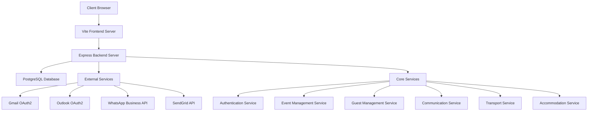
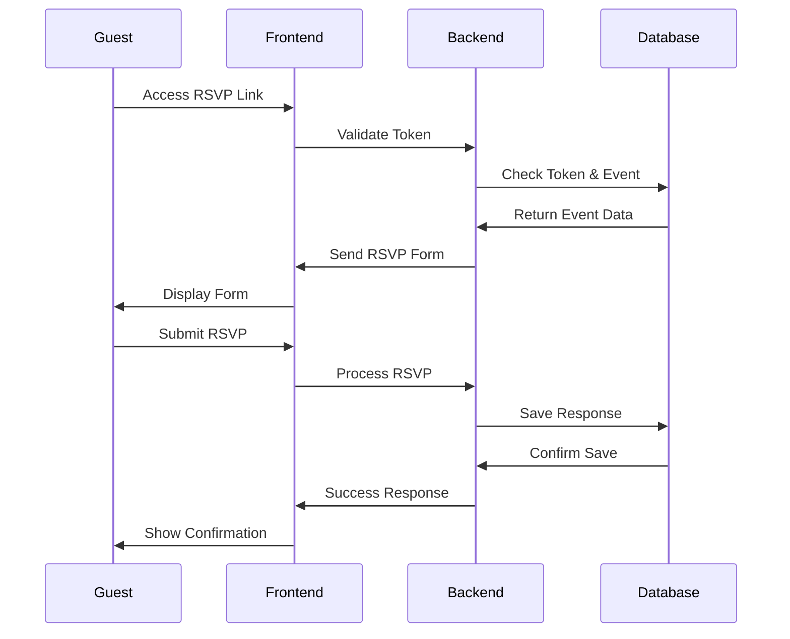

# System Architecture

## Overview

The Wedding RSVP Platform is built as a sophisticated multi-tenant system with complete event isolation, implementing modern web application patterns with a luxury design system. The architecture supports complex wedding logistics while maintaining elegant user experiences.

## 🏗️ Architecture Principles

### Multi-Tenant Design
- **Complete Data Isolation**: Each wedding event is entirely separate
- **Session-Based Context**: Event switching with proper cache invalidation
- **Secure Boundaries**: No cross-event data leakage
- **Scalable Architecture**: Support for unlimited concurrent events

### Modern Stack
- **Backend**: Node.js + TypeScript + Express.js
- **Frontend**: React 18 + TypeScript + Vite
- **Database**: PostgreSQL with Drizzle ORM
- **Authentication**: Session-based with role-based access control
- **Design**: Apple iOS 18-inspired luxury minimal aesthetic

## 📊 System Diagram



## 🔧 Technical Components

### Backend Architecture
- **Express.js Server**: RESTful API with middleware chain
- **Drizzle ORM**: Type-safe database operations
- **Session Management**: PostgreSQL-backed sessions
- **Authentication**: Passport.js with role-based access
- **Multi-tenant Logic**: Event context isolation

### Frontend Architecture  
- **React 18**: Modern hooks and component patterns
- **TanStack Query**: Sophisticated data fetching and caching
- **Wouter**: Lightweight client-side routing
- **shadcn/ui**: Modern component library
- **Design System**: Centralized styling with tokens

### Database Design
- **Event Isolation**: All tables scoped by eventId
- **Relational Integrity**: Foreign key constraints
- **Migration System**: Drizzle Kit for schema changes
- **Session Storage**: PostgreSQL session store

## 📱 Application Layers

### Presentation Layer
- **React Components**: Reusable UI components
- **Design System**: Consistent styling and theming
- **State Management**: TanStack Query for server state
- **Routing**: Client-side routing with authentication

### Business Logic Layer
- **API Routes**: Express.js route handlers
- **Service Layer**: Business logic abstraction
- **Validation**: Zod schemas for type safety
- **Authentication**: Session-based auth with middleware

### Data Layer
- **Database Schema**: PostgreSQL with proper relationships
- **ORM**: Drizzle for type-safe queries
- **Migrations**: Version-controlled schema changes
- **Session Store**: Database-backed session management

## 🔐 Security Architecture

### Authentication & Authorization
- **Session-Based Auth**: Secure server-side sessions
- **Role-Based Access**: Admin, staff, couple permissions
- **Event Context**: Users can only access authorized events
- **CSRF Protection**: Built-in request validation

### Data Security
- **Multi-Tenant Isolation**: Complete event data separation
- **Input Validation**: Zod schemas on all inputs
- **SQL Injection Prevention**: ORM parameter binding
- **Environment Variables**: Sensitive data protection

## 📡 Integration Architecture

### Communication Systems
- **Email Integration**: Multiple provider support
  - Gmail OAuth2 with SMTP fallback
  - Outlook OAuth2 via Microsoft Graph
  - SendGrid API integration
  - Generic SMTP server support

- **WhatsApp Integration**: Dual implementation
  - WhatsApp Business API for templates
  - WhatsApp Web.js for direct messaging

### External Services
- **OAuth2 Providers**: Google and Microsoft integration
- **Email Services**: Multiple provider redundancy
- **Messaging APIs**: WhatsApp Business integration
- **AI Services**: Anthropic Claude for assistance

## 🔄 Data Flow Architecture

### RSVP Process Flow


### Event Context Management
1. **User Login**: Authentication and session creation
2. **Event Selection**: Set current event in session
3. **Context Isolation**: All operations scoped to current event
4. **Cache Invalidation**: Clear caches on event switch
5. **Data Filtering**: Automatic event-based data filtering

## 📊 Performance Architecture

### Frontend Optimization
- **Code Splitting**: Lazy-loaded routes and components
- **Bundle Optimization**: Vite with modern bundling
- **Caching Strategy**: TanStack Query with smart invalidation
- **Image Optimization**: SVG-first approach for scalability

### Backend Optimization
- **Database Indexing**: Optimized queries with proper indexes
- **Connection Pooling**: PostgreSQL connection management
- **Middleware Chain**: Efficient request processing
- **Session Storage**: Database-backed session management

### Caching Strategy
- **Client-Side**: TanStack Query with stale-while-revalidate
- **Session Storage**: PostgreSQL for consistency
- **Static Assets**: Vite with asset optimization
- **API Responses**: Conditional rendering based on data freshness

## 🚀 Deployment Architecture

### Replit Configuration
- **Environment**: Node.js 20 with PostgreSQL 16
- **Build Process**: Vite for frontend, esbuild for backend
- **Development**: Hot reload with middleware integration
- **Production**: Static asset serving with Express fallback

### File Structure
```
/
├── client/                 # Frontend React application
│   ├── src/
│   │   ├── components/     # Reusable UI components
│   │   ├── pages/         # Route components
│   │   ├── design-system/ # Design tokens and utilities
│   │   └── lib/           # Client utilities
├── server/                # Backend Express application
│   ├── routes.ts          # API route handlers
│   ├── middleware.ts      # Authentication and validation
│   └── db.ts             # Database connection
├── shared/               # Shared TypeScript types
│   └── schema.ts         # Database schema definitions
├── docs/                # Comprehensive documentation
└── scripts/             # Database migration scripts
```

## 🔧 Development Architecture

### Code Organization
- **Shared Types**: Common TypeScript interfaces
- **Component Library**: Reusable UI components
- **Design System**: Centralized styling approach
- **API Utilities**: Standardized HTTP operations

### Build System
- **Vite**: Modern build tool with HMR
- **TypeScript**: Full type safety across stack
- **ESLint**: Code quality and consistency
- **Prettier**: Automated code formatting

### Testing Strategy
- **Type Safety**: TypeScript compilation checks
- **Database**: Migration testing and rollback
- **API**: Integration testing with real data
- **UI**: Component testing with design system

## 📈 Scalability Considerations

### Horizontal Scaling
- **Stateless Design**: Session data in database
- **Database Scaling**: PostgreSQL with read replicas
- **CDN Support**: Static asset distribution
- **Load Balancing**: Multiple server instances

### Vertical Scaling
- **Efficient Queries**: Optimized database operations
- **Memory Management**: Proper resource cleanup
- **Connection Pooling**: Database connection optimization
- **Caching**: Multi-layer caching strategy

## 🔍 Monitoring & Observability

### Application Monitoring
- **Error Tracking**: Comprehensive error logging
- **Performance Metrics**: Response time monitoring
- **User Analytics**: Feature usage tracking
- **Health Checks**: System status monitoring

### Database Monitoring
- **Query Performance**: Slow query identification
- **Connection Status**: Pool health monitoring
- **Storage Usage**: Capacity planning
- **Index Optimization**: Query plan analysis